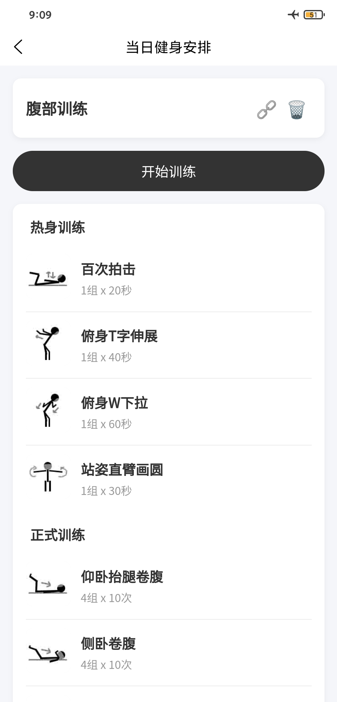
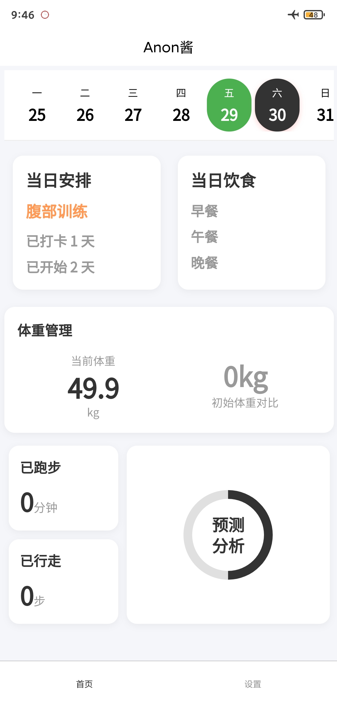
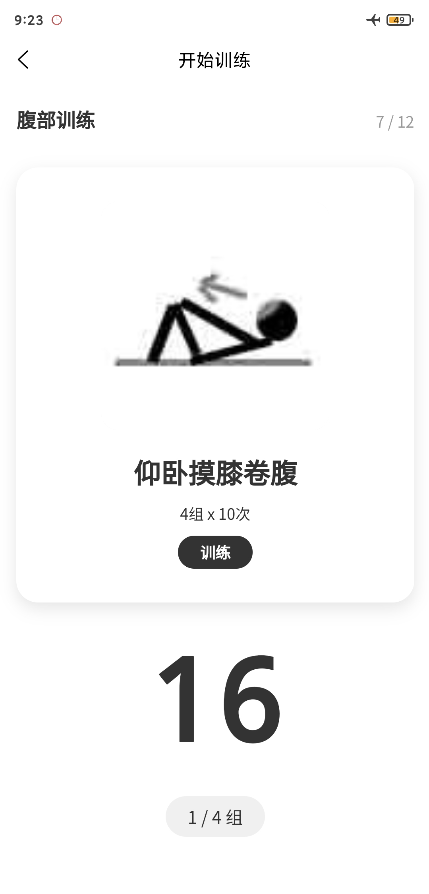

# Anon酱

使用Uniapp Vue2编写，根据个人需求整合的一款自助式健身APP，完全本地化使用。

## 功能板块

- **健身训练** — 安排每日健身计划，训练自动计时，提示播报
- **健身管理** — 自定义健身计划，动作图片推荐100x100的JPG，具体计划动作自行网络检索适合自己的即可
- **饮食管理** — 记录每日三餐情况，简单统计吃的最多的食物供参考复盘
- **体重管理** — 记录体重变化，与最初的数据比较
- **运动管理** — 记录每日运动情况，仅供参考复盘
- **经期管理** — 记录每次经期，根据规律进行简单预测参考

## 开发说明

- 本项目以个人使用设备机型为基础开发，未作屏幕适配，也未进行各种环境唐化操作兼容测试。
- 开发缘由是市面上找的APP要么收费，要么有广告，要么功能没涵盖自身需求，遂搓了一个，共享出来。
- 效果图可能与你实际看到的不一致，根据机型调整代码即可
  

## 版权声明

- 项目中使用的音效及图标相关素材版权归 **BUSHIROAD** 旗下 **BanG Dream! 企划** 所有。
- 本项目仅供免费使用及学习交流。
